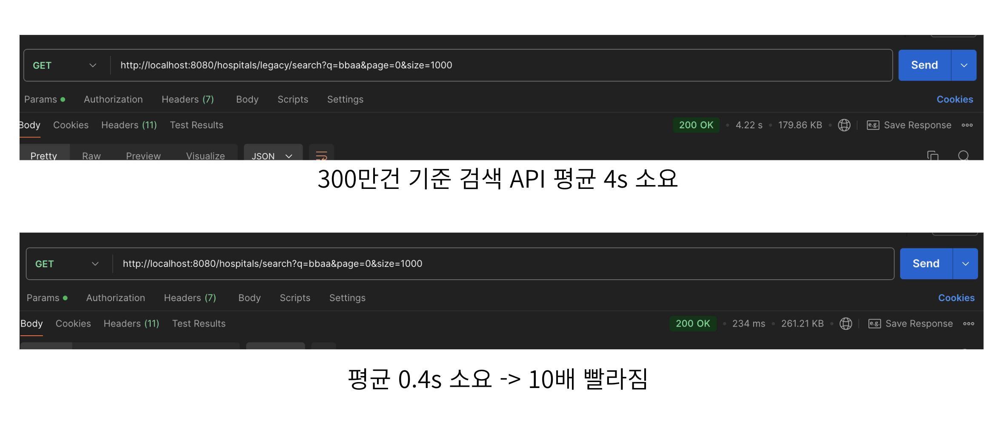

# 📌 병원 관리 사이트 - BackEnd Application 📌

---

# README TEST

---

## 🪕 프로젝트 이름

### 의사결정(DocDe:Doctor Decision)

---

## 📝 **프로젝트 소개**

### 온라인 병원 예약 시스템으로서 환자가 손쉽게 진료 예약을 하고, 대기 시간을 최소화하며, 병원은 효율적으로 환자 데이터를 관리할 수 있도록 하는 프로젝트입니다.

---

## 🚩프로젝트 핵심 목표

대규모 트래픽 대응

- 병원 예약 시스템
    - Redis를 활용하여 특정 시간대일 경우에는 **비동기 큐**를 그외의 시간에는  **저트래픽에 캐싱과 분산락 트래픽** 처리
    - 시스템이 다양한 트래픽 상황에서도 **안정적이고 일관된 데이터 상태를 유지**하며, 동시성 문제를 효과적으로 해결
- 병원 접수 시스템
    - 순간적인 대규모 트래픽(트래픽 스파이크)을 효율적으로 핸들링
- 오토 스케일링
    - 부하에 따라 동적으로 서버를 늘려 대규모 트래픽 상황에 대응

성능 최적화

- 대용량 데이터 검색시 엘라스틱 서치 도입으로 검색 성능을 10배 향상

CI/CD 배포 파이프 라인 완성

- Docker와 Github Actions를 이용한 CI/CD 파이프라인 구축으로 배포 자동화
- AWS의 S3,IAM과 같은 서비스를 사용해 CI/CD 배포 라인 간소화
- 필요한 포트,필요한 권한만을 부여해 보안 취약점 보완
- EC2 AutoScaling의 인스턴스 새로고침을 이용한 Rolling방식의 무중단 배포 구현

---

## 🚀 KEY Summary

### 🍁 **성능 개선 : 병원 검색 성능, Elasticsearch 도입으로 10배 향상**

1. **한 줄 요약**
    - Elasticsearch 도입으로 기존 LIKE 조회보다 10배 성능 개선
    - 대용량 데이터 검색시 빠른 속도를 기대

      

2. **도입 배경**
    - 기존의 LIKE 검색에 인덱스를 적용하였는데, 성능 향상이 되지 않음
    - `LIKE %검색어%` 문은 인덱스를 사용할 수 없어서 생기는 문제
    - 대규모 데이터시 빠르게 검색 결과를 받아볼 수 있어야 함
3. **기술적 선택지**
    1. **Full Text Search 사용**
        - LIKE 문보다는 텍스트를 효율적으로 검색 가능
        - 부분 문자열 검색을 지원하지 않음
        - 복잡한 검색 쿼리에 대한 지원이 부족
    2. **Elasticsearch 사용**
        - 강력한 검색 기능을 지원
        - 대용량 데이터 처리에 최적화 되어 있음

| 결론: Elasticsearch를 도입하여 성능을 크게 개선 |
|-----------------------------------|

### 🍁 성능 개선 : 비동기 큐와 캐싱+락 도입으로 처리량 향상

1. **한 줄 요약**
    - 높은 트래픽인 경우 :비동기 큐를 사용해서 큐에 요청을 적재하고, **병렬워커와 배치**를 사용해 병렬적으로 처리하여 처리량과 안정성 개선
    - 낮은 트래픽인 경우 : 락으로 **중복 요청**이나 **동시성 문제**를 방지하고, 캐싱으로 DB 접근 횟수 줄여 보다 빠른 응답 제공하도록 개선

|       | Throughput |      
|:------|-----------:|
| 적용X   |   156.6sec |
| 비동기 큐 | 1467.6/sec | 
| 캐싱+락  | 1975.5/sec | 

2. **도입 배경**

    - 특정 시간대에 예약이 몰릴것이라고 예상하여 병렬워커와 배치를 통한 요청을 병렬적으로 처리하여 처리량 개선과 시스템 과부하 방지
    - 상대적으로 예약요청이 많지 않은시간대에서 캐싱된 데이터를 메모리에서 처리하여 빠른 응답을 제공하고, 락으로 중복 예약을 방지하고 데이터 일관성을 보장하기 위함

3. **기술적 선택지**

    - 비동기 큐 대안 : RabbitMQ/Kafka
        - Redis는 단일 인스턴스에서도 초당 수십만 건의 요청 처리가 가능
        - Redis는 가벼운 데이터 구조를 이용해 보다 쉽게 구현 가능
    - 캐싱+락 대안 : Zookeeper
        - Redis는DB에 접근하지 않고도 캐시에서 예약 가능 여부 확인 가능
        - Redis는 메모리 기반이므로 캐싱된 데이터에 대해 매우 빠른 읽기/쓰기 성능 제공

---

## 🔅인프라 아키텍처

### 아키텍처 다이어그램

---

## ⛏️️ ️️**주요 기술 스택**

### ***Language&Framework&Tool***

### ***Server/Deployment***

### ***DataBase/Cache***

---

## 📦 적용 기술 상세보기

### 💻언어 및 프레임 워크

- Java17
- Spring boot 3.3.4
- Spring Security

### 💾데이터베이스 및 캐싱

- MySQL
- Redis
    - 사용 이유 : 빠른 성능을 바탕으로 캐싱이나 메세지 큐 같은 실시간 데이터
      처리에 이상적이고 TTL을 설정하여 캐싱된 데이터를 일정시간 이후 자동삭제하므로 효율적

### 🔍검색 엔진

- Elastic Search

### 🔬테스트

- Jmeter
- Junit5
- Postman

### 🖥️모니터링

- Prometeus
- Grafana

### 🌐 **인프라 및 배포**

- AWS EC2
    - 적용 위치:Spring Application,ELK서버 구동
- AWS S3
    - 적용 위치:컨테이너 실행을 위한 application.yml 파일과 .env 파일 업로드 및 다운로드
- AWS IAM
    - 적용 위치:협업을 위한 FullAccess 권한을 팀원들에게 부여해 쉽게 같은 VPC내에서 작업할 수 있도록 설정,배포를 위해 AWS CLI를 사용하기 위해 역할 설정
      배포를 위한 역할(GitHub Actions),EC2(S3버킷 접근)은 최소한으로 설정해 보안에 문제가 발생하는 것을 최소화함
- AWS RDS
    - 적용 위치:MySQL과 Redis를 AWS RDS 서비스를 사용해 구현
    - 사용 이유:
      - 관리형 서비스를 사용해 인프라 관리에 소요되는 시간과 리소스 절약 가능
      - RDS 서비스는고가용성 및 내구성을 지니고 있어 장애가 생겼을때 빠른 복구 가능
- Docker
    - 적용 위치: 모든 서비스 컨테이너화
    - 사용 이유: 환경 이식성과 배포 속도 개선
- Docker Hub
    - 사용 이유: ECR과 비교해서 개발 초기에는 모든 서비스를 도커로 띄울것을 예상하지 못해 ECR을 고려하지 않아 사용이 쉽고 무료인 도커허브를 사용
    - 또 다른 선택지:만약 처음부터 컨테이너 기반의 서비스를 제공하려 했다면 ECR,ECS와 같은 컨테이너 기반의 서비스도 유효
    - 적용 위치: CI/CD 파이프라인
    - 사용 이유: 자동화된 코드 품질 검사와 배포 구현에 필요
    - 또 다른 선택지:Jenkins도 고민해 보았지만 깃허브 액션의 쉬운 환경설정과 제한된 사용량 내에서 비용이 적다는 점이 매력적
- Prometheus & Grafana
    - 적용 위치: 모니터링 서버
    - 사용 이유: 개발 및 테스트 단계에서 Prometheus & Grafana를 실행해서 시스템 상태를 모니터링하며 고트래픽 환경에서 발생할 수 있는 문제를 파악
- EC2 AutoScaling
    - 적용 위치: EC2 서버
    - 사용 이유: 특정상황에 트래픽이 급증하거나 갑자기 서버가 다운되는 경우에 동적으로 서버의 갯수를 늘이거나 줄일 필요가 있다고 생각됨

---

## **🔔 Core functions**

### 🍁 병원 예약 요청 : Redis 큐 비동기 처리 및 락+캐싱 처리

- 특정 시간대(08시-10시) - 비동기 큐
    - 고트래픽 상황이 예상되는 특정 시간대에는 **비동기 큐를 활용**하여 요청을 대기열에 쌓고 **순차적으로 처리**하는 구조를 유지
- 그 외의 시간대 : 캐싱+락
    - **동시성 문제**를 해결하고, **예약이 중복되지 않도록 제어**

### 🍁 병원 접수 : 동시성 문제 예상과 해결

- 배경
    - 병원 접수 로직의 대기 번호 부여 부분에 동시성 문제가 발생할 가능성이 보였고, 실제로 테스트 해 본 결과 동시성 문제가 발생함을 확인
- 요구사항
    - 동시에 많은 접수 요청이 발생하더라도 접수 번호 데이터의 일관성이 유지되어야 함
- 고민했던 선택지
    - 비관적, 낙관적 락, 분산 락
        - Zookeeper, MySQL, Redis
        - Redisson, Jedis, Lettuce
- 선택 사유
    - 비관적 락 선택 사유 : 어플리케이션이 여러 서버에서 실행될 때를 고려해 선택
    - Redis 선택 사유 : 가장 처리 속도가 빠르며 이미 어플리케이션이 Redis를 사용 중이기 때문에 선택
    - Redisson 선택 사유 : 비교군 중 분산 락을 위한 추상화가 가장 높은 수준으로 되어 있어 고수준의 분산 락을 간편하게 적용 가능해 선택
- 주요 로직
    - Redis DB와 Redis의 Redisson 클라이언트에서 제공하는 RLock 클래스를 AOP 방식으로 사용해 분산 락 기능을 설정
    - 동시성 문제가 발생하는 로직의 서비스 레이어 메서드에 어노테이션을 적용하여 사용하며 락의 키 이름과 대기 시간, 지속 시간을 각각 설정 가능하게 만들어 확장성을 높임

### 📗CI/CD : CI/CD 파이프라인

Case:Develop Branch

- CI-AutoTest의 Flow

1. 코드 디렉토리로 체크아웃
2. Gradle 캐시가 있다면 가져옴
3. Gradle을 실행시켜 Test를 진행

- CI-Dependency Submission

1. 의존성 그래프를 생성
2. 깃허브에 의존성을 제출해 의존성의 보안 취약점을 자동으로 탐지

Case:Main Branch

- CD

1. Gradle 캐시가 있다면 가져옴
2. GitHub Secrets에서 환경변수(.env)를 가져와 .env 파일 작성
3. Gradle로 빌드를 진행해 코드에 문제가 없는지 확인
4. Docker Compose를 설치해 실행
5. 빌드할때 필요한 인증서를 AWS S3에서 가져옴
6. prod 환경에서 필요한 docker-compose.yml 파일과 생성한 .env 파일을 s3에 업로드
7. 도커이미지 빌드
8. 도커허브에 로그인
9. 도커허브로 이미지 푸쉬
10. instance-refresh-config.json에 정의된 내용으로 EC2 Autoscaling 기능 중 하나인
    인스턴스 새로고침을 시행해 무중단 배포 시작

### 📡무중단 배포

- 배경: 기존의 CI/CD 파이프라인은 배포를 위해 가동중이던 서버를 전부 내리고 배포를 해야 하는 즉 Downtime이 존재. 하지만 배포 과정에서 문제가 발생하면 서비스 중단 시간이 길어짐
- 요구사항: 신버전이 업데이트 되어도 제공중인 서비스는 다운 되면 안됨
- 선택지:Rolling 방식,Canary 방식,blue and green 방식 등
- 선택이유:Rolling 방식. 쉽게 구현할 수 있고, 추가적인 서버 리소스도 들지 않음  
AWS autoscaling의 내장 기능인 인스턴스 새로고침을 통해 쉽고 빠르게 구현 가능

---

##  🔥 기술적 고도화

 🍁예약요청 API에서 비동기 큐(배치와 병렬워커)와 캐싱+락 활용 

### 🍁 예약요청 API에서 비동기 큐(배치와 병렬워커)와 캐싱+락 활용

    
---

- **배경**

  - 병원 예약 시스템에서 트래픽은 시간대와 상황에따라 변화하기 때문
  - 특정시간에 따라 최적화된 동시성 제어가 필요한 상황
  
  

- **트래픽 상황에 따른 솔루션**
  1. 비동기 큐 기반 처리
     - Redis Queue 활용
       - 동시 요청이 많아도 안정적인 처리 가능
       - 트래픽 급증 시 요청을 대기열로 관리해서 **병목 현상**이 완화
       - 예약 요청 손실을 방지하고 처리 순서를 보장
     - 배치 처리
       - N개 단위 배치 처리를 통해 큐에서 데이터를 묶어 처리
       - I/O 요청을 줄이고 처리 효율을 극대화하기 위해 사용
     - 병렬 워커
       - 각 워커는 Redis 큐에서 데이터를 가져와 **동시성 문제를 해결**
       - 병렬 워커는 고트래픽 환경에서 보다 높은 TPS를 달성하기 위하여 사용
       
  2. 캐싱 + 분산 락
      - Redis 캐싱으로 빠른 응답
          - 요청이 들어올 때마다 의사ID와 예약 가능시간 데이터를 캐싱하여 DB 직접 조회를 최소화
      - Redisson 분산락으로 데이터 정합성 보장
          - 분산 환경에서도 Redis 락을 사용하여 동일 시간대와 동일 의사에 대한 **중복 요청을 차단**
          - 락의 TTL(Time-to-Live) 설정하여 동일한 lockkey에 대해 다른 요청이 동시에 접근하지 못하게 하여 락의 TTL(Time-to-Live) 설정하여 **데드락을 방지**
      - 트랜잭션 격리
          - 격리 수준을 `Isolation.SERIALIZABLE` 설정하여, **데이터 무결성을 보장**

   ---

- **로직 흐름**

  1. 비동기 큐
      - 시간대를 설정하여 Redis 큐에 추가하여 비동기 처리
      - 요청을 JSON으로 직렬화하여 큐에 저장
      - TTL을 설정하고 큐 데이터를 일정 시간 후 자동삭제
      - 병렬 워커를 통해 큐 데이터를 비동기로 처리
      - Redis 큐에서 요청 데이터를 배치로 가져와 역직렬화
      - 예약 요청 데이터를 handler에 전달하고 예약 로직 실행

  2. 캐싱 + 분산 락
     - 분산 락을 통한 동시성 제어(쓰기 병목 방지)
          - AOP를 활용한 동시 접근 제어
          - 고유 락키를 생성하여 Redisson 분산 락을 획득 - lock.tryLock(10,30,TimeUnit.SECONDS)
          - 락을 획득하여 실제 비즈니스 로직을 실행하고 락을 해제
          - 락을 획득하지 못한다면 예외를 던짐
          - 즉, 동일한 예약 시간, 의사 ID에 대하여 여러 작업이 수행되지 않도록하고, 분산 환경에서도 데이터 정합성을 유지하도록 하여 병목 최소화

      1. Redis를 활용한 캐싱(읽기 병목 방지)
          - Redis에 데이터를 저장하고 TTL을 설정하여 유효기간 관리하여 반복적으로 조회되는 데이터 캐싱(예약시간, 의사ID)
          - 캐시에 저장된 데이터를 조회하고 없는 경우 DB에서 조회하도록 설계
          - 즉, Redis 캐싱을 사용해 DB 요청 횟수를 줄이고 읽기 성능을 최적화하도록 함

- **적용 후 개선 효과**
  - 비동기 큐
      - 처리량 증가 : 156/sec → 1467/sec
      - 병목현상 해결
- 캐싱+락
    - 처리량 증가 : 156/sec → 1975/sec
    - 쓰기, 읽기 병목 해결
    - 쓰기 병목 : 경쟁조건 해결-동시성 문제 완화
    - 읽기 병목 : DB 트래픽 최소화

- **데이터 시각화**

  - 적용 전

      

  - 비동기 큐 적용

    

  - 캐싱 + 락 적용

    

- **의사결정/사유**

  - 현재 비동기 큐와 캐싱+락에 같은 고트래픽 부하를 했을때, 캐싱+락이 처리량면에서 우수한 모습을 보이지만, 예약요청이 높을 것 같은 시간대에 비동기 큐를 적용하였습니다. 설계에 있어서 목표가 고트래픽일때
    서버 부하 분산 및 안정성 유지가 목표였고, 트래픽이 높은 시간대에도 Redis 큐에 요청을 저장하여 서버 과부하 방지 및 서버 처리량에 맞게 조절이 가능하도록 하는것이었습니다. 또한 트래픽이 적은
    시간대에서는 비동기 큐의 지연이 불필요하다 생각하여, 락과 캐싱을 통해 적은 요청을 처리하며 즉각적인 응답을 주도록 설계하였습니다.
  - 비동기 큐와 캐싱+락을 도입하며 처리량 향상과 병목현상을 해결했지만, 테스트 결과 설계와는 다르게 캐싱+락이 처리량면에서 우수한 현상이 나타나게 되었습니다. 트래픽, 배치, 병렬 워커 설정을 최적화하며
    처리량을 높혀보도록 테스트를 진행했지만, 컴퓨터의 하드웨어 리소스(CPU,메모리100%) 한계에 도달하며 최적화 진행이 의미없는 상황이라, 추후 Redis Cluster도입 및 클라우드 기반 확장을 통하여
    TPS를 높혀 볼 수 있을 것 같습니다.

🍁병원 접수 : redis와 websocket을 사용한 대기열 구현

### 🍁병원 접수 : redis와 websocket을 사용한 대기열 구현

---

- 배경
    - 서버가 감당할 수 없는 트래픽 스파이크 상황 가정
    - 서비스 특성상 병원의 영업 개시 시간이나 점심 시간 등 특정 시간에 높은 트래픽이 발생해도, 이러한 트래픽 증가가 오래 지속되지는 않을 것이라 생각.
    - 대기열 방식으로 해당 순간의 서버 부하만 컨트롤
- 요구사항
    - 동시에 작업하는 유저를 원하는 인원수 만큼 제한할 수 있어야 함
    - 동시 작업 수 제한에 도달한 상황에서 들어오는 요청을 사용자가 따로 재시도하지 않아도 순차적으로 서버 내부에서 처리해야 함
    - 사용자가 대기 현황이나 처리 현황을 알 수 있어야 함
- 고민했던 선택지
    - 대기열 방식
    - AWS Lambda를 사용해 접수 처리를 하는 방식
- 대기열 방식을 선택한 이유
    - 서비스 특징 상 높은 트래픽이 긴 시간 유지되지는 않을 것이라 생각했고, 한 순간의 높은 트래픽만 모면할 수 있다면 서비스에 문제가 없을 것이라 판단
    - AWS Lambda를 사용 시엔 트래픽의 양과 시간에 관계 없이 모두 처리 가능하지만
      비용이 발생한다는 큰 단점이 있음
- 주요 로직
    - 서비스 레이어의 접수 메서드에 유저 카운트 aop 적용
    - 유저 카운트 aop는 메서드 시작 시 redis의 특정 키를 가진 값을 1 증가시키고,
      메서드 종료 시 1 감소시킴
    - 이로 인해 '현재 작업 중인 유저 수'를 측정 가능
    - 작업 중인 유저 수가 일정 수치 이상이거나 대기열에 유저가 존재하면
      컨트롤러 레이어에서 429 오류를 반환하며 해당 요청 유저 정보와 요청 내용을 redis에 저장
    - 이후 해당 유저 정보를 redis로 관리되는 대기열에 넣음
    - 주기적으로 실행되는 메서드에서 작업 중인 유저 수 확인 후 일정 수치 이하로 내려가면
      대기열에 있는 유저를 정해진 수 만큼 삭제
    - 대기열에서 삭제된 유저의 정보와 그 유저가 요청한 정보를 서비스 레이어로 보내 작업 수행
    - 작업 수행 결과를 Websocket을 사용해 대기 중인 유저에게 알림
    - 대기열에서 삭제되지 않은 유저에게는 Websocket을 사용해 남은 대기열을 전송
    - 유저가 대기하지 않고 429 오류를 확인한 시점에서 클라이언트를 종료해도 작업이 완료되도록 함

---

## 🛠️ 트러블 슈팅

 
 🛠️ 트러블 슈팅 : 배포환경에서의 Elasticsearch 인증서 문제

- **배경**
    - 엘라스틱 서치를 연결하기 위해 CA 인증서가 필요한 상황
    - 도커가 아닌 환경에서는 JDK가 있는 certs 디렉토리에 keytool을 이용해 인증서를 추가하는 방식으로 인증처리를 할 수 있음
- **문제**
    - 배포 환경에서는 도커 환경에서 인증서를 추가해야 하는데 어떤식으로 추가 해야하는 것인가?
    - Elasticsearch 서버에서 어떤식으로 인증서를 배포환경으로 옮길 것인가?
- **해결 방안**
    - 인증서 추가 방식: 도커파일을 실행하는 시점에 도커컨테이너 내부에 인증서를 담는방식(도커파일 빌드시점에) 이 방식을 사용하면 GitHub Actions에서 도커파일로 이미지화 할때만 인증서를
      사용하기 때문에 배포환경에서 인증서를 넣어줄 필요가 없음

 
🛠️ 트러블 슈팅 : AWS CLI 오류 발생

- **배경**
    - CD 과정 중 시작 템플릿에 AWS S3 버킷에서 파일을 다운받는 코드를 작성하던 작업중 지속적인 오류 발생
    - 실패한 과정의 로그를 확인해도 로그가 남지 않아 이유를 찾지 못함
- **문제**
    - 이유는 AWS CLI로 접속해 스크립트를 실행할때 절대 경로가 아니라 상대 경로로 사용해 AWS CLI가 경로를 제대로 인식하지 못해 생긴 문제

- **해결 방안**: 상대경로를 절대경로로 수정하니 문제가 해결. 문제의 원인을 찾을때는 꼭 디버그 옵션을 키고 로그를 확인해서 문제를 찾아야 함

 
🛠️ 트러블 슈팅 : 단일 워커 처리 한계로 인한 병목 문제

- **배경**
    - 병원 예약 시스템에서 예약 요청을 처리하기 위해 Redis 큐와 단일 워커를 활용
    - 예약 요청은 Redis 큐에서 하나씩 가져와 순차적으로 처리
- **문제**
    - 병목 현상이 발생하여 Redis 큐에 처리되지 않은 요청이 계속 쌓임
    - 단일 워커가 순차적으로 작업을 처리하므로, 높은 트래픽에서 처리가 지연
    - 큐에서 요청이 적시에 소비되지 않아 요청 처리 지연
    - 단일 워커는 CPU 코어와 메모리를 효율적으로 사용하지 못함
- **해결 방안**
    - 병렬 워커 도입
        - 단일 워커 대신 여러 개의 워커를 사용하여 병렬로 예약 요청을 처리
        - CPU 사용률이 높아지고 시스템 자원을 효율적으로 활용
    - 배치 처리 적용
        - Redis 큐에서 요청을 하나씩 처리하는 대신, 여러 요청을 한 번에 가져와 처리

 
🛠️ 트러블 슈팅 : 접수 번호 기록의 동시성 문제

- **배경**
  - 접수 로직에서 유저 식별을 위한 '번호'를 부여
  - redis에 '최대 번호'가 저장되어 있고 이 번호를 가져 와 접수가 저장된 후 '최대 번호'에 1을 더함
- **문제**
  - 접수 로직의 대기 번호 부여 부분에 동시성 문제가 발생해 데이터의 일관성이 유지되지 않음
  - 1이 더해진 '최대 번호'가 저장되기 전에 다른 트랜잭션에서 읽고 사용하기 때문
- **해결**
  - 분산 락 적용
    - redis의 redisson 클라이언트를 사용해 분산 락 적용
    - 다중 서버 환경에서도 데이터 일관성 유지 가능
    - AOP를 사용해 다른 동시성 문제 발생 시 쉽게 락 적용 가능

## 🙌 역할 분담 및 협업 방식

### **Detail Role**

| 이름  | 포지션 | 담당(개인별 기여점)                                                                                                              | Github 링크                                    |
|-----|-----|--------------------------------------------------------------------------------------------------------------------------|----------------------------------------------|
| 김진근 | 리더  | ▶ 유저 인증: JWT 토큰 기반 유저 인증 기능 구현, 레디스를 활용해 이메일 인증 구현   ▶ 검색: Elasticsearch를 도입해 대용량 데이터 검색 성능 개선                        | [[🍁 깃헙링크]](https://github.com/KJG04)        |
| 이길환 | 부리더 | ▶CI/CD 파이프 라인 구축   ▶AWS 인프라 구축                                                                                        | [[🍁 깃헙링크]](https://github.com/Multiverse22) |
| 이보성 | 팀원  | ▶  예약요청에서 트래픽이 부하할 시간대에는 메세지 큐를 그외의 시간대는 캐싱락으로 동시성제어/대규모트래픽 처리                                                           | [[🍁 깃헙링크]](https://github.com/BoSung308)    |
| 유현식 | 팀원  | ▶ 접수 : 순간적인 트래픽 급증 시 서버 부하를 컨트롤하기 위해 Redis 기반으로 접속 대기열 구현   ▶ 대기 중 알림 : websocket을 사용해 대기 중인 사용자가 남은 대기 인원을 알 수 있도록 함 | [[🍁 깃헙링크]](https://github.com/20240729)     |

---

### **Ground Rule**

**🍁 모르는 거 있으면 편하게 물어보기**

**🍁 자리 비울 시 ZEP 춤추기 눌러 놓기**

**🍁 자리비움이 길어지면 슬랙이나 ZEP 채팅방에 꼭 꼭 꼭 남기기**

**🍁 PR해서 merge가 생기면 슬랙 채팅방에 기록 남겨서 자리에 부재중이였던 사람도 알게하기!!**

**🍁 긍정적인 태도로 소통하기**

**🍁 경청과 존중**

**🍁 반대되는 의견 제시시 근거와 대안을 확실하게 말하기**

**🍁 듣는 사람의 기분 생각하기**

**🍁 해결이 안될거 같은 갈등은 튜너님이나 매니저님 활용하기**

**🍁 본인의 의견이 수용되지 않아도 마음에 담아두지 않기**

**🍁 아침 회의 10:10**

- 오늘 작업할 내용 회의

**🍁 저녁 회의 19:45**

- 오늘 작업한 내용 간략하게 회의

## 📍 성과 및 회고

### 잘된 점

- **성능 최적화 성공**
    - Redis를 토입해 대규모 트래픽 환경에서도 특정 시간에 정확하게 예약 요청을 성공
    - Redis 메세지 큐와 캐싱+락을 이용해 예상 목표였던 처리량 1000/sec를 초과한 1500/sec와 2000/sec에 가까운 기록을 달성
    - 오래 걸리는 검색 API Elasticsearch 도입해서 개선
- **효율적인 협업**
    - 팀원 간 역할 분담이 명확했으며, GitHub Actions를 활용한 CI/CD 구축으로 개발-배포 주기를 단축 및 무중단 배포 구현
    - 매일 스크럼을 통해 문제를 빠르게 공유하고, 적극적으로 해결
- 예상하지 못 한 인원 이탈에도 불구하고 적절한 대응으로 프로젝트 완성
    - 이탈한 팀원에게 작성한 로직을 인계받은 후 빠르게 역할을 재분배하여 혼란 최소화

---

### 아쉬운 점

- **프로젝트 초기 설계 부족**
    - 도메인 설계 및 서비스 분리 단계에서 충분한 검토가 이루어지지 않아 일부 마이크로서비스 간 의존성 증가
- **일부 성능 개선 테스트 부족**
    - 접수 로직에 트래픽이 몰릴 때 비동기 큐로 트래픽을 분산시키는 기능을 제대로 테스트 하지 못 함(테스트 환경에서 요청을 보내는 속도보다 처리하는 속도가 빨라서 한계를 보지 못 함)
    - 예약요청에서 CPU/메모리 리소스 한계에 도달하여 처리량과 응답시간을 더 끌어올리지 못 함

---

### 향후 계획

- **기술적 고도화**
    - 예약요청에서 Redis 클러스터링과 로드밸런서/오토스케일링을 서버에 추가하여 큐 데이터를 여러 노드에 분산하고 애플리케이션을 서버에 추가함으로써 Redis 부하를 분산시켜 처리량과 응답시간을 더욱 고도화
      예정
    - 현재 도커 이미지 파일의 태그관리가 잘 되지 않음. 이 부분은 특정 branch명과 (prod,dev) 도커이미지를 업로드 하는 시간을 붙여 예) my-app:dev-2024-11-21 과 같은
      버전관리로 문제발생시 원인을 빠르게 찾을수 있게하고 Stable한 버전을 보관하는 방식으로 고도화 예정
    - CI/CD 배포 파이프라인 중 무중단배포 과정중 문제가 생기면 롤백하는 과정이 없어 개발자가 직접 인스턴스에 접속해 이전 버전 을 받아와 다시 실행시켜야 하는 번거로움이 있음.  
  현재 프로젝트는 대부분의 프로그램을 도커 컨테이너로 띄우고 있기 때문에 ECS와 같은 컨테이너 관리 서비스가 더 좋다고 판단되면 마이그레이션 하는 방향도 고려 중.
- **추가 기능 개발**
    - 사용자 피드백 시스템 도입으로 서비스 품질을 지속적으로 향상
    - 예약요청에서 웹소켓을 활용하여 비동기 큐에서 적재/소비 상태를 클라이언트에 실시간 전달하고, 예약 가능 여부를 캐싱에서 확인한 뒤 전달하는 기능 추가 개발
- **테스트 자동화 강화**
    - 기존 단위 테스트 외에 통합 테스트 및 부하 테스트를 추가하여 안정성을 더욱 강화
