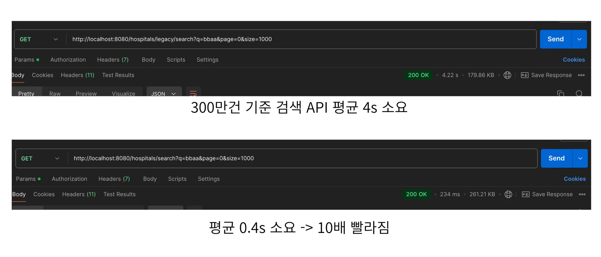
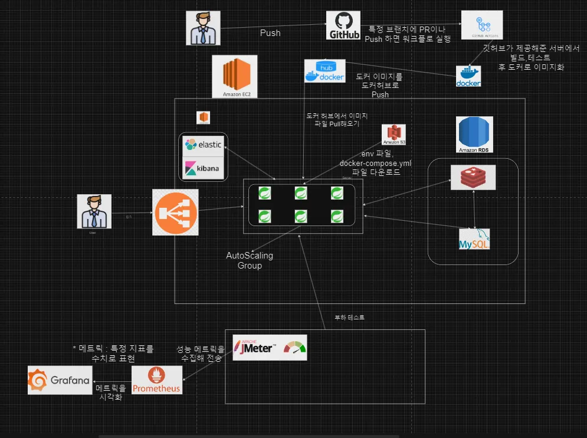

# ⭐ 프로젝트 개요

## 🧾의사결정

### 온라인으로 간편하게 병원 접수와 예약을 할 수 있는 서비스

## 서비스/프로젝트 소개

온라인 병원 예약 시스템을 개발하여 환자가 손쉽게 진료 예약을 하고, 대기 시간을 최소화하며, 병원은 효율적으로 환자 데이터를 관리할 수 있도록 하는 프로젝트입니다.

-----

## 프로젝트 핵심 목표

1. **대규모 트래픽 대응**
    - Redis와 Kafka를 활용한 비동기 처리를 통해 API 요청 200req/sec 이상 처리.
    - 동시성 문제를 해결하며 안정적인 쿠폰 발급 서비스 제공.

2. **성능 최적화**
    - Redis 기반 캐싱으로 실시간 상품 조회 성능을 3배 향상.
    - Redisson을 사용하여 CPU 점유율 50% 감소 및 안정적 데이터 처리 구현.

3. **운영 및 배포 효율화**
    - Docker와 Github Actions를 이용한 CI/CD 파이프라인 구축으로 배포 자동화.
    - Prometheus와 Grafana를 활용한 실시간 모니터링으로 시스템 안정성 확보.

4. **데이터 일관성 및 트랜잭션 관리**
    - Kafka를 이용한 SAGA 패턴으로 분산 트랜잭션 관리.
    - 중복 및 데이터 손실을 방지하는 Kafka Batch Listener 구현.

---

# KEY Summary

## 🍁 **성능 개선 : 병원 검색 성능,** Elasticsearch **도입으로 10배 향상**

1. **한 줄 요약**
    - Elastic Search 도입으로 기존 LIKE 조회보다 10배 성능 개선
    - 대용량 데이터 검색시 빠른 속도를 기대

      

2. **도입 배경**
    - 기존의 LIKE 검색에 인덱스를 적용하였는데, 성능 향상이 되지 않음
    - `LIKE %검색어%` 문은 인덱스를 사용할 수 없어서 생기는 문제
    - 대규모 데이터시 빠르게 검색 결과를 받아볼 수 있어야 함
3. **기술적 선택지**
    1. **Full Text Search 사용**
        - LIKE 문보다는 텍스트를 효율적으로 검색 가능
        - 부분 문자열 검색을 지원하지 않음
        - 복잡한 검색 쿼리에 대한 지원이 부족
    2. **Elastic Search 사용**
        - 강력한 검색 기능을 지원
        - 대용량 데이터 처리에 최적화 되어 있음

   결론: Elastic Search를 도입하여 성능을 크게 개선

---

## 🍁 기술적 고도화 : 고트래픽과 저트래픽에 따른 유동적 제어

# 수정해주세요!!!!!

----

## 인프라 아키텍처

---

---

<!--

 📦 적용 기술 상세보기
-->

### 💾 **데이터베이스 및 캐싱**

- 언어 및 프레임워크
    - Java 17
    -  Version 3.3.4 
    - Spring Security

### 💾 **데이터베이스 및 캐싱**

- MySQL
    - 사용 이유 : 높은 고가용성,높은 확장성,관리 용이함,내구성 높음
- Redis
    - 사용 이유 : 빠른 성능을 바탕으로 캐싱이나 메세지 큐 같은 실시간 데이터
      처리에 이상적이고 TTL을 설정하여 캐싱된 데이터를 일정시간 이후 자동삭제하므로 효율적

### 🔍검색 엔진

- ElasticSearch
    - 대용량 데이터 검색시 빠른 성능

### 👥️협업 도구

- Github
- Slack

### 🔬테스트

- 테스트
    - Jmeter
    - Junit5
    - Postman

### 🖥️모니터링

- Prometeus
- Grafana

### 🌐 **인프라 및 배포**

- **Docker**
    - **적용 위치**: 모든 서비스 컨테이너화
    - **사용 이유**: 환경 이식성과 배포 속도 개선.

- **Github Actions**
    - **적용 위치**: CI/CD 파이프라인
    - **사용 이유**: 자동화된 코드 품질 검사와 배포 구현에 필요

- **Prometheus & Grafana**
    - **적용 위치**: 이부분은 수정해주세요
    - **사용 이유**: 이부분은 수정해주세요

<!--
-->

## 주요 기능

### 🍁 **쿠폰 발급: Redis 및 Kafka를 통한 비동기 처리**

- 대용량 트래픽을 수용하기 위해 Redis와 Kafka를 활용한 비동기 쿠폰 발급 시스템 구현.
- Redis Lua Script로 동시성 제어 및 쿠폰 발급 상태 관리.

---

### 🍁 **주문 처리: Saga 패턴 적용**

- 각 서비스 간 독립적 트랜잭션 관리를 위해 Saga(Choreography) 패턴 적용.
    - **주요 흐름**: `상품 재고확인 & 차감` → `쿠폰 사용 확인 & 상태 변경` → `적립금 사용 확인 & 차감`.
- 오류 발생 시 자동 롤백을 통해 데이터 일관성 유지.

---

### 🍁 **최저가 조회: Redis 캐싱 활용**

- Redis 캐싱을 이용해 상품의 실시간 최저가 제공.
- 짧은 TTI와 TTL 설정으로 리소스 절약 및 캐싱 효율성 극대화.

---

### 🍁 **결제 정산: Spring Batch 5 활용**

- 대규모 결제 데이터를 특정 시간에 자동으로 처리하는 배치 시스템 구축.
    - **프로세스 흐름**: `결제 완료 데이터 조회` → `수수료 차감` → `정산 결과 저장`.
- 배치 처리로 대규모 트랜잭션 최적화.

## 기술적 고도화

<b>🍁 분산락 Redisson 도입으로 CPU 점유율 2배 개선</b>

### 왜 동시성 제어 시 여러 선택지가 있는데, 분산락을 사용했을까요?

---

#### 낙관적 락과 비관적 락의 선택지

분산락을 채택하기 이전에는 비관적 락으로 동시성 제어를 선택했습니다.

- **비관적 락**  
  비관적 락으로 데이터를 조회하면 해당 트랜잭션이 끝나기 전까지는 데이터에 대한 Insert 작업이 불가능합니다.
    - 단점: 트래픽이 많은 경우 성능 저하 발생 및 타임아웃 문제.

- **낙관적 락**  
  낙관적 락은 충돌 발생 시 롤백 처리를 요구하며, 충돌 비용이 높습니다.
    - 단점: CPU 점유율이 상승하고, 예상치 못한 오류 발생 가능.

---

#### Redis로 분산락을 채택한 이유

1. **Lettuce의 문제점**  
   Lettuce는 스핀락 방식을 사용하여 락이 풀릴 때까지 계속 Redis에 요청을 보냅니다.
    - 결과적으로 Redis CPU 점유율이 높아지는 문제가 발생.

2. **Redisson의 장점**  
   Redisson은 Pub-Sub 구조로 락이 종료될 때 이벤트를 발행하며, 락 요청을 효율적으로 처리합니다.
    - 결과적으로 Redis CPU 점유율이 낮아집니다.

---

### 적용 후

- **CPU 점유율:** 기존 60% → 30% 감소
- **TPS:** 기존 1400 → 2500으로 향상

---

<b>🍁 Jpa로 배치 처리 시 더티체킹 문제</b>

### 배경

- `JpaItemReader` 채택
    - `스프링 배치`에서 제공하는 `ItemReader` 인터페이스로 데이터를 조회하는 구현체입니다.
    - Jpa 엔티티의 메서드를 사용하기 위해 `JpaItemReader`를 선택했습니다.

---

### 문제

- **더티체킹으로 인한 성능 문제**
    - 예상보다 더 많은 쿼리가 발생했습니다.
    - 5만 건을 500개씩 배치 처리할 경우, 100개의 쿼리가 아닌 `100 + 5만`건의 쿼리가 추가 발생.
    - 데이터 처리 시간: **4분 46초**

---

### 해결

- **JdbcPagingItemReader로 변경**
    - 더티체킹 문제를 제거하며 추가적인 쿼리 발생을 방지했습니다.
    - 결과적으로 데이터 처리 시간이 기존 4분 46초에서 **60초로 4.6배 개선**되었습니다.

---

### 향후 계획

- **Java 21의 가상 스레드 활용**
    - `TaskExecutor`를 재구성하여 병렬 처리 효율성을 극대화할 예정입니다.

## 역할 분담 및 협업 방식

### **Detail Role**

| 이름  | 포지션 | 담당(개인별 기여점)                                                                                                                                          | Github 링크 |
|-----|-----|------------------------------------------------------------------------------------------------------------------------------------------------------|-----------|
| 김ㅇㅇ | 리더  | ▶ **결제**: 토스페이먼츠 PG 연동, 간편결제 구현 ▶ **정산**: 스프링 배치 활용 (Jpa → Jdbc 변경하여 4.6배 개선) ▶ **배포**: 멀티모듈 설정, 멀티 데이터소스 설정, Graceful Shutdown 구현, CI/CD 적용   | [🍁 깃헙링크] |
| 조ㅇㅇ | 부리더 | ▶ **쿠폰**: Redis Lua Script를 통한 동시성 제어 및 대규모 트래픽 제어 ▶ **타임세일**: Kafka 비동기 발급 처리, 분산락을 통한 동시성 제어                                                    | [🍁 깃헙링크] |
| 박ㅇㅇ | 팀원  | ▶ **주문**: MSA 기반 주문 로직 구현, Kafka 기반 SAGA 패턴 적용 ▶ **스케줄러**: 결제 단계 주문 자동 삭제                                                                         | [🍁 깃헙링크] |
| 정ㅇㅇ | 팀원  | ▶ **유레카 & 게이트웨이**: CircuitBreaker, Retry 장애 대응 구축 ▶ **유저**: Kafka Batch Listener를 활용한 대용량 데이터 적재 ▶ **상품**: Redis 최저가 조회 성능 개선, Kafka 비동기 통신 구현 | [🍁 깃헙링크] |

---

### **Ground Rule**

🍁 **문제 발생 시 즉시 공유**

- 문제가 발생하면 팀원들에게 빠르게 상황을 공유하여 협력 해결.

🍁 **정규 시간 내 풀타임 화면 공유**

- 업무 시간 동안 항상 화면을 공유하여 투명한 협업 유지.

🍁 **사소한 것도 질문하기**

- 궁금한 점이나 막힌 부분은 사소한 것이라도 즉시 물어보고 해결.

🍁 **스크럼에서 트러블 슈팅 및 구현 사항 설명**

- 매일 스크럼 시간에 구현 진행 상황과 문제 해결 과정을 공유.

🍁 **1Day, 1Issue, 1PR 원칙**

- 하루에 하나의 이슈를 처리하고 PR 생성.

🍁 **1PR 당 3개 이상의 리뷰 남기기**

- 각 PR에 대해 최소 3개의 리뷰를 작성하여 코드 품질을 개선.

## 성과 및 회고

### 잘된 점

- **성능 최적화 성공**
    - Redis와 Kafka를 도입해 대규모 트래픽 환경에서도 안정적인 쿠폰 발급 구현.
    - API 처리량 250req/sec를 초과 달성하며 목표를 상회하는 성과를 기록.

- **효율적인 협업**
    - 팀원 간 역할 분담이 명확했으며, GitHub Actions를 활용한 CI/CD 구축으로 개발-배포 주기를 단축.
    - 매일 스크럼을 통해 문제를 빠르게 공유하고, 적극적으로 해결.

---

### 아쉬운 점

- **프로젝트 초기 설계 부족**
    - 도메인 설계 및 서비스 분리 단계에서 충분한 검토가 이루어지지 않아 일부 마이크로서비스 간 의존성 증가.

- **시간 부족으로 일부 기능 미완성**
    - 사용자 피드백 시스템과 추가 정산 기능 개발이 지연되어 구현하지 못함.

---

### 향후 계획

- **기술적 고도화**
    - Java 21의 가상 스레드를 도입하여 병렬 처리 성능을 개선하고, 무중단 배포를 위한 추가적인 CI/CD 개선 계획.

- **추가 기능 개발**
    - 사용자 피드백 시스템 도입으로 서비스 품질을 지속적으로 향상.
    - 데이터 분석 기능을 추가해 쿠폰 발급 및 사용 데이터를 기반으로 한 비즈니스 인사이트 제공.

- **테스트 자동화 강화**
    - 기존 단위 테스트 외에 통합 테스트 및 부하 테스트를 추가하여 안정성을 더욱 강화.

